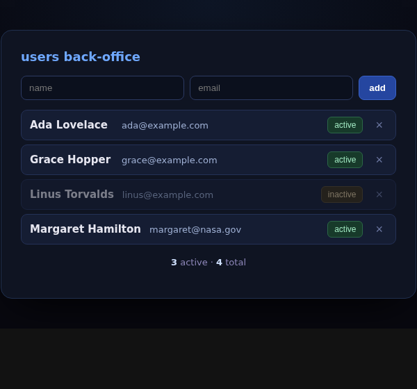

# machin-web-demo-users — a CRUD back-office, in machin

A users admin back-office: a **single native binary** that is a **CLI**, an **HTTP
server**, a **SQLite-backed JSON API**, and serves its own **reactive WebAssembly
UI** — list, add, toggle active, delete. The whole app is MFL; no Node, no bundler.
This is the "manage my users database" recipe from the
[`machin-web` skill](https://github.com/javimosch/machin/blob/main/skills/machin-web/SKILL.md),
built end to end.



## Architecture (SPA over an API)

```
  src/reactive.src ─ src/client.src ── machin --target wasm ─▶ app.wasm  (the reactive view)
                                                                  │ served by ↓
  src/machweb.src ─ src/flags.src ─ src/page.src ─ src/server.src ┴─ machin ─▶ ./machin-users
                                                     (web/host.js embedded; SQLite store)
```

- **Server** (`server.src`): the source of truth. SQLite (`sqlite_open`/`sqlite_exec`
  with `?`-bound params / `sqlite_query` → JSON rows). Routes: `GET /` (the SPA
  shell), `GET /app.wasm`, `GET /api/users` (JSON), `POST /api/users?name=…&email=…`
  (insert), `POST /api/users/active?id=N` (toggle), `POST /api/users/del?id=N`. A CLI
  via `flags` (`--port`, `--help`).
- **Client** (`client.src`): a reactive *view*. The host fetches `/api/users` and
  hands the JSON to `load()`, which parses it with `json_get` into signals; a keyed
  list renders the rows and a computed shows the active count. Every mutation goes
  **host → API → reload** — and because the list is **keyed**, a reload patches only
  the rows that actually changed.
- **Host** (`web/host.js`): the generic ~40-line JS host — the reactive DOM ops, the
  `fetch` orchestration, and writing the form's text + the API's JSON *into* wasm.

This is the **SPA-over-API** shape (the server is authoritative; the client is a
reactive view). For the *isomorphic* shape (one component SSRs on the server and
hydrates in the browser), see
[boilerplate-cli-ui-machin-isomorphic](https://github.com/javimosch/boilerplate-cli-ui-machin-isomorphic).

## What it exercises

| machin capability | where |
|---|---|
| **SQLite** (`sqlite_*`, parameterized) | the store + API |
| **JSON API** (`ok_json`, `sqlite_query` → JSON) | `/api/users` |
| **JSON parsing** (`json_get`) | the client loads the user list |
| **host→wasm strings** (`ptr_str`) | the JSON blob, and form text |
| **reactivity** (signals, computed, keyed list, templating) | the view |
| **single binary serves its own wasm** (`ok_wasm`) | `/app.wasm` |
| **CLI** (`flags`) | `--port` / `--help` |

## Build & run

Needs `machin` (**v0.57.0+**), [`zig`](https://ziglang.org), and **libsqlite3** (the
server links it).

```sh
./build.sh                 # → ./app.wasm and ./machin-users
./machin-users             # serves http://localhost:48097/  (creates users.db)
./machin-users --port 8080 # …or another port;  --help for flags
```

## Make it your own

- **A field:** add a column to the `CREATE TABLE`, include it in the `SELECT`, render
  it in `row_html`, and pass it in the add form.
- **A route:** add a branch in `handle(req)` returning `ok_json(...)`.
- **Validation / auth:** it's all MFL in `handle` — check the body, a header, a token.

See the [`machin-web` skill](https://github.com/javimosch/machin/blob/main/skills/machin-web/SKILL.md)
and the [web north star](https://github.com/javimosch/machin/blob/main/docs/NORTH-STAR-WEB.md).

## License

MIT
